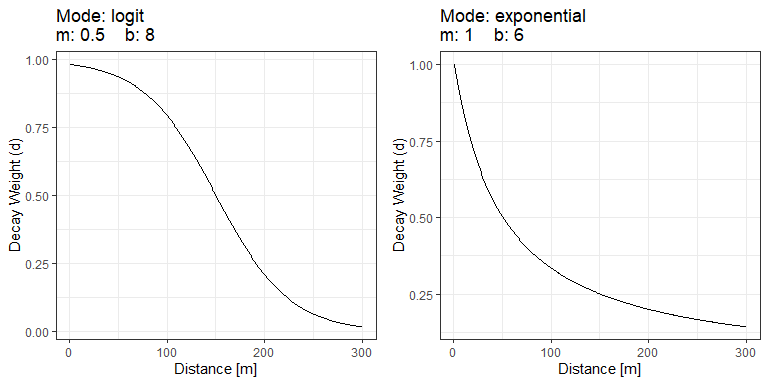
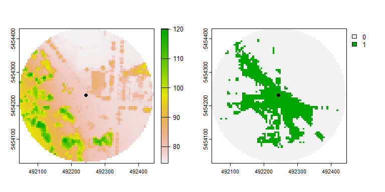
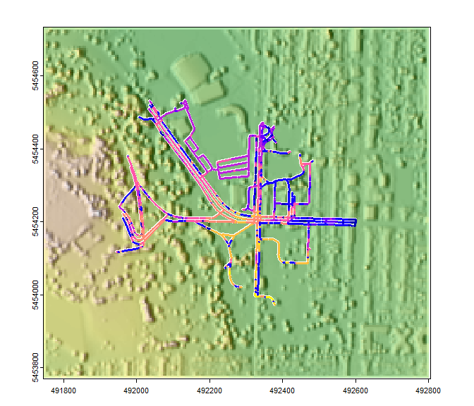

<!-- README.md is generated from README.Rmd. Please edit that file -->

# CGEI

<!-- badges: start -->

[](https://github.com/STBrinkmann/CGEI/actions/workflows/R-CMD-check.yaml)

<!-- badges: end -->

The goal of CGEI is to …

## Installation

1.  Install [R](https://cran.r-project.org/)

    - (Recommended) Install
      [RStudio](https://www.rstudio.com/products/rstudio/download/)

2.  Install [terra](https://github.com/rspatial/terra)

3.  Install CGEI:

    - Install remotes

      `install.packages("remotes")`

    - Install `CGEI`

      `CGEI` is still in very active development. Therefore, the package
      is also not on CRAN yet. You can install the latest version of
      `CGEI` from GitHub with:  
      `remotes::install_git("https://github.com/STBrinkmann/CGEI")`

## Examples

### Data

For the first two examples we will use a [Digital Elevation Model
(DEM)](https://opendata.vancouver.ca/explore/dataset/digital-elevation-model),
a binary Greenspace Mask based on a [land cover
classification](http://www.metrovancouver.org/data) and a Digital
Surface Model (DSM). The DSM is generated from [LiDAR data collected in
2013](https://opendata.vancouver.ca/explore/dataset/lidar-2013/). A
detailed explanation on how the DSM has been generated using R is
provided in
[this](https://geobrinkmann.com/post/visible-greenness-exposure/)
tutorial. To reduce the size of the R package, the sample data has been
uploaded to a separate GitHub repository and needs to be downloaded
first.

``` r
# Download DEM
DEM_tmp <- tempfile(fileext = ".tif")
download.file(url = "https://github.com/STBrinkmann/data/raw/main/GVI_Data/GVI_DEM.tif",
              destfile = DEM_tmp, mode="wb")

# Download DSM
DSM_tmp <- tempfile(fileext = ".tif")
download.file(url = "https://github.com/STBrinkmann/data/raw/main/GVI_Data/GVI_DSM.tif",
              destfile = DSM_tmp, mode="wb")

# Download GreenSpace
GS_tmp <- tempfile(fileext = ".tif")
download.file(url = "https://github.com/STBrinkmann/data/raw/main/GVI_Data/GVI_GreenSpace.tif",
              destfile = GS_tmp, mode="wb")

# Download hoechstetter
hoechstetter_tmp <- tempfile(fileext = ".tif")
download.file(url = "https://github.com/STBrinkmann/data/raw/main/GVI_Data/hoechstetter.tif",
              destfile = hoechstetter_tmp, mode="wb")
```

``` r
# Load libraries. if one is not installed, use the "install.packages()" function
library(terra)
library(sf)
library(sfheaders)
library(CGEI)

# Load raster objects
GreenSpace <- rast(GS_tmp)
DEM <- rast(DEM_tmp)
DSM <- rast(DSM_tmp)
hoechstetter <- rast(hoechstetter_tmp)
```

### Viewshed Greenness Visibility Index (VGVI)

The VGVI expresses the proportion of visible greenness to the total
visible area based on a viewshed. The estimated VGVI values range
between 0 and 1, where 0 = no green cells are visible, and 1 = all of
the visible cells are green.

Based on a viewshed and a binary greenspace raster, all visible points
are classified as visible green and visible no-green. All values are
summarized using a decay function, to account for the reducing visual
prominence of an object in space with increasing distance from the
observer. Currently two options are supported, a logistic and an
exponential function.

$$\begin{align*} f(x) = \cfrac{1}{1 + e^{b(x-m)}} && \text{(logistic)}\\ f(x) = \cfrac{1}{1 + (bx^{m})} && \text{(exponential)} \end{align*} $$

The full algorithm has been described in [Brinkmann et
al. (2022)](https://doi.org/10.5194/agile-giss-3-27-2022).

The `visualizeWeights` function helps to adjust spatial weight
parameters *m* and *b* used in the `vgvi` and `vgvi_from_sf` functions.


*Example output of the* `visualizeWeight` *function to compare and
parameterize the decay weights of a logistic (left) and an exponential
(right) function.*

#### 1. Single Point

Calculate the viewshed for a 200 meters radius around the observers
position at 1.7 meters height (eye level).

``` r
# Generate single observer point
observer <- st_sf(sf_point(c(492243.3, 5454231.4)), crs = st_crs(26910))
vs <- viewshed_list(observer = observer, dsm_rast = DSM, dtm_rast = DEM, 
                    max_distance = 200, observer_height = 1.7)
```



*Left: Digital Surface Model (DSM); Right: Viewshed, where green =
visible and yellow = no-visible area.*

The VGVI can now be calculated using the `vgvi` function.

``` r
vgvi_sf <- vgvi(observer = observer, 
                dsm_rast = DSM, dtm_rast = DEM, greenspace_rast = GreenSpace, 
                max_distance = 200, observer_height = 1.7)
vgvi_sf$VGVI
#> [1] 0.6134167
```

The output of ~0.61 indicates, that ~61% of the visible area, within a
200 meters radius, is covered by greenspace.

#### 2. Road Network

We also provide sample data of a SF LINESTRING feature, representing a
road network. This feature represents roads and paths, that can be
reached by walking within 5 minutes from our observer location.

``` r
# Download line feature and load as sf object
isodistance <- read_sf("https://github.com/STBrinkmann/data/raw/main/GVI_Data/isoline.gpkg")
```

Compute the VGVI along the line feature. As the resolution of our DSM is
5 meters, points along the line feature will be generated every 5
meters, too.

``` r
vgvi_sf <- vgvi(observer = isodistance, 
                dsm_rast = DSM, dtm_rast = DEM, greenspace_rast = GreenSpace, 
                max_distance = 200, observer_height = 1.7, spacing = 2,
                m = 1, b = 3, mode = "exponential", cores = 12)
```

The plot below shows the VGVI along the line feature. Yellow has a high
VGVI, while blue has a low VGVI. The VGVI is highest in parks and lowest
in urban center in the east.

