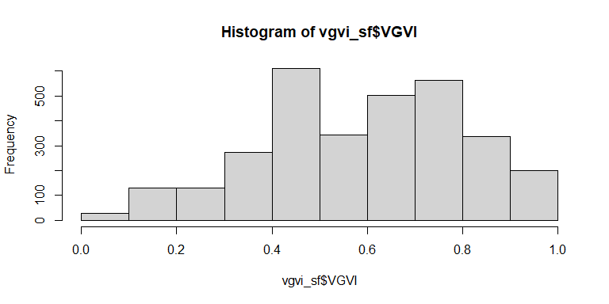

<!-- README.md is generated from README.Rmd. Please edit that file -->

# CGEI

<!-- badges: start -->

[](https://github.com/STBrinkmann/CGEI/actions/workflows/R-CMD-check.yaml)

<!-- badges: end -->

The goal of CGEI is to …

## Installation

1.  Install [R](https://cran.r-project.org/)

    - (Recommended) Install
      [RStudio](https://www.rstudio.com/products/rstudio/download/)

2.  Install [terra](https://github.com/rspatial/terra)

3.  Install CGEI:

    - Install remotes

      `install.packages("remotes")`

    - Install `CGEI`

      `CGEI` is still in very active development. Therefore, the package
      is also not on CRAN yet. You can install the latest version of
      `CGEI` from GitHub with:  
      `remotes::install_git("https://github.com/STBrinkmann/CGEI")`

## Examples

### Data

For the first two examples we will use a [Digital Elevation Model
(DEM)](https://opendata.vancouver.ca/explore/dataset/digital-elevation-model),
a binary Greenspace Mask based on a [land cover
classification](http://www.metrovancouver.org/data) and a Digital
Surface Model (DSM). The DSM is generated from [LiDAR data collected in
2013](https://opendata.vancouver.ca/explore/dataset/lidar-2013/). A
detailed explanation on how the DSM has been generated using R is
provided in
[this](https://geobrinkmann.com/post/visible-greenness-exposure/)
tutorial. To reduce the size of the R package, the sample data has been
uploaded to a separate GitHub repository and needs to be downloaded
first.

``` r
# Download DEM
DEM_tmp <- tempfile(fileext = ".tif")
download.file(url = "https://github.com/STBrinkmann/data/raw/main/GVI_Data/GVI_DEM.tif",
              destfile = DEM_tmp, mode="wb")

# Download DSM
DSM_tmp <- tempfile(fileext = ".tif")
download.file(url = "https://github.com/STBrinkmann/data/raw/main/GVI_Data/GVI_DSM.tif",
              destfile = DSM_tmp, mode="wb")

# Download GreenSpace
GS_tmp <- tempfile(fileext = ".tif")
download.file(url = "https://github.com/STBrinkmann/data/raw/main/GVI_Data/GVI_GreenSpace.tif",
              destfile = GS_tmp, mode="wb")
```

Load DSM, DEM and Greenspace Mask, and generate the observer location as
a `sf` `POINT` feature.

``` r
# Load libraries. if one is not installed, use the "install.packages()" function
library(terra)
library(sf)
library(sfheaders)

# Load raster objects
GreenSpace <- rast(GS_tmp)
DEM <- DEM_tmp %>% rast() %>% resample(GreenSpace)
DSM <- DSM_tmp %>% rast() %>% resample(GreenSpace)

# Generate single observer point
observer <- st_sf(sf_point(c(492243.3, 5454231.4)), crs = st_crs(26910))
```

### 1. Single Point

Calculate the VGVI for a 200 meters radius around the observers position
at 1.7 meters height (eye level).

``` r
library(CGEI)
vgvi_sf <- vgvi(observers = observer, 
                dsm_rast = DSM, dtm_rast = DEM, greenspace_rast = GreenSpace, 
                max_distance = 200, observer_height = 1.7, mode = "exponential")
vgvi_sf$VGVI
#> [1] 0.6700769
```

The output of ~0.67 indicates, that ~67% of the visible area, within a
200 meters radius, is covered by greenspace.

### 2. Road Network

We also provide sample data of a SF LINESTRING feature, representing a
road network. This feature represents roads and paths, that can be
reached by walking within 5 minutes from our observer location.

``` r
# Download line feature and load as sf object
isodistance <- read_sf("https://github.com/STBrinkmann/data/raw/main/GVI_Data/isoline.gpkg")
```

Compute the VGVI along the line feature. As the resolution of our DSM is
5 meters, points along the line feature will be generated every 5
meters, too.

``` r
vgvi_sf <- vgvi(observers = isodistance, 
                dsm_rast = DSM, dtm_rast = DEM, greenspace_rast = GreenSpace, 
                max_distance = 200, observer_height = 1.7, 
                m = 1, b = 3, mode = "exponential", cores = 12)

hist(vgvi_sf$VGVI)
```


